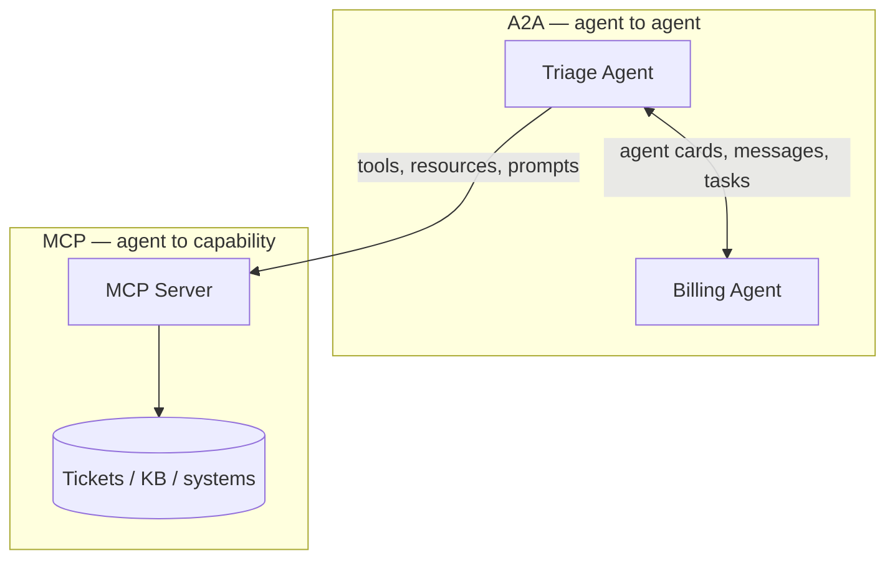

# Hands-On Agent Protocol Integration

A ~15 minute, heavily-commented workshop on the two protocols you need to build
real agent systems: **MCP** (via FastMCP) and **A2A** (via Google ADK).

Built for aspiring **Forward Deployed Engineers**. Runs entirely in GitHub
Codespaces. The only paid resource is an Azure OpenAI endpoint.

---

## The one sentence

> **MCP gives an agent hands. A2A gives an agent colleagues.**



Different layers, not competing choices. Section 3 builds an agent that uses
both at once.

---

## Start in 60 seconds

Open in Codespaces. Dependencies install during creation, so there is nothing
to install when you get a terminal.

```bash
cp .env.example .env          # fill in your Azure OpenAI values
uv run python scripts/preflight.py
```

Keys are the quick path. For keyless auth with Entra ID / managed identity,
leave `AZURE_API_KEY` blank, run `uv sync --group entra`, and sign in with
`az login` (or assign a managed identity to the compute).

`preflight.py` checks versions, makes a real Azure call, tests the ports, and
validates the agent card. If it passes, the demo will run.

Then go to **[docs/00-overview.md](docs/00-overview.md)**.

---

## The three sections

| # | Lab | Time | You will |
|---|---|---|---|
| 1 | [MCP](docs/01-lab-mcp.md) | ≤5 min | Run an MCP server; watch an agent discover its tools and schemas |
| 2 | [A2A](docs/02-lab-a2a.md) | ≤5 min | Publish an agent; watch another agent delegate to it |
| 3 | [Interop](docs/03-lab-interop.md) | ≤5 min | Build one agent that consumes MCP *and* is published over A2A |

Plus [Stateless MCP](docs/04-stateless-mcp.md) — the deployment conversation you
will actually have with a customer — and
[Going further](docs/05-going-further.md).

Each lab is: **run one command, look at one thing, read one file.** The reading
is where the teaching is. The source files are commented well past normal
production standards on purpose — the comments *are* the course.

---

## Scenario

A deliberately boring internal **IT support desk**: tickets, a knowledge base,
and a billing specialist. All data is in-memory Python dicts. Nothing here
should compete for attention with the protocol mechanics.

---

## Commands

```bash
./scripts/run_mcp_server.sh    # :8000  MCP server        (Section 1)
./scripts/run_a2a_server.sh    # :8001  A2A server        (Section 2)
./scripts/run_web.sh           # :8002  ADK dev UI        (Section 2)
./scripts/run_interop.sh       # :8003  Interop agent     (Section 3)

uv run python scripts/preflight.py
```

---

## Layout

```
├── src/helpdesk/
│   ├── data.py                        in-memory tickets + KB (no dependencies)
│   ├── azure_llm.py                   the one Azure OpenAI wiring point
│   ├── mcp_server/server.py           SECTION 1 — 3 tools, 1 resource, 1 prompt
│   ├── a2a/
│   │   ├── remote/billing_agent/      SECTION 2 — published over A2A
│   │   └── local/triage_agent/        SECTION 2 — delegates to it
│   └── interop/support_agent/         SECTION 3 — MCP client + A2A server
├── notebooks/                         inspectors for sections 1 and 2
├── docs/                              the labs
└── scripts/                           run + preflight
```

---

## Stack

| Package | Version | Why pinned |
|---|---|---|
| `fastmcp` | 3.4.7 | Stable, and supports `stateless_http=True` |
| `google-adk[a2a,mcp,extensions]` | 2.6.3 | A2A + MCP client + LiteLLM |

Both request compatible `mcp` ranges, so they share **one** virtualenv.
FastMCP 4.x would not — see [04 — Stateless MCP](docs/04-stateless-mcp.md) for
why that trade was made deliberately.

Requires Python 3.10–3.12 and an Azure OpenAI deployment with a tool-calling
API version (`v1` for AI Foundry endpoints, `2024-10-21` or newer for classic
ones).

---

## Something broken?

[docs/troubleshooting.md](docs/troubleshooting.md). Start with `preflight.py`.

---

## License

MIT — see [LICENSE](LICENSE).
