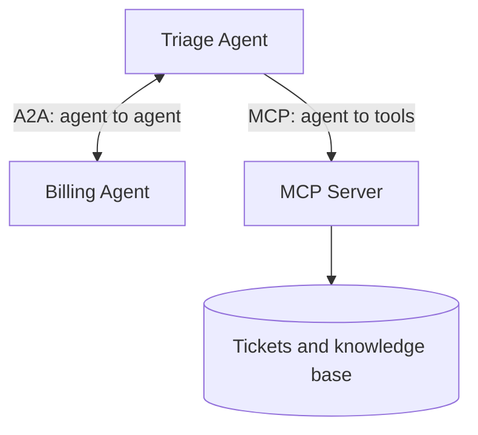

# Hands-On Agent Protocol Integration

Learn the two protocols that connect AI agents to everything else — in about
15 minutes, entirely in your browser.

Written for engineers who are **new to agent protocols**. Runs in GitHub
Codespaces. The only thing you pay for is an Azure OpenAI endpoint.

> **New to the vocabulary?** Read the **[glossary](docs/glossary.md)** first.
> It is one page and defines every term used here.

---

## The idea in one sentence

> **MCP gives an agent hands. A2A gives an agent colleagues.**

An agent on its own can only produce text. To be useful it needs two things:

1. A way to **do** things — read a ticket, search a database. That is **MCP**.
2. A way to **ask other agents** for help. That is **A2A**.



They solve different problems, so most real systems use both.

---

## Getting started

**1.** Open this repository in a **GitHub Codespace**. Dependencies install
automatically while it builds.

**2.** Add your Azure OpenAI details:

```bash
cp .env.example .env
```

Open `.env` and fill in the values. Each one is explained in the file.

There are two ways to sign in — pick one:

| | How | When to use it |
|---|---|---|
| **API key** | Paste your key into `AZURE_API_KEY` | Fastest. Use this for the workshop. |
| **Keyless** | Leave `AZURE_API_KEY` blank, run `uv sync --group entra`, then `az login` | No secret stored in a file |

**3.** Check that everything works:

```bash
uv run python scripts/preflight.py
```

This makes a real call to Azure and checks the ports are free. If it passes,
the labs will run.

**4.** Go to **[docs/00-overview.md](docs/00-overview.md)**.

---

## The labs

| # | Lab | Time | What you do |
|---|---|---|---|
| 1 | [MCP](docs/01-lab-mcp.md) | 5 min | Run a tool server; watch an agent discover its tools |
| 2 | [A2A](docs/02-lab-a2a.md) | 5 min | Publish an agent; watch another agent hand work to it |
| ⭐ 3 | [Both together](docs/03-lab-interop.md) | 5 min | **Optional bonus lab** — one agent that uses both |

Labs 1 and 2 are the core workshop. Lab 3 is a bonus you can skip if time is
short.

Background reading:

- **[Glossary](docs/glossary.md)** — every term, in plain English
- **[Stateless MCP](docs/04-stateless-mcp.md)** — running MCP on more than one server
- **[Going further](docs/05-going-further.md)** — security, scale, production
- **[Troubleshooting](docs/troubleshooting.md)** — when something breaks

Every lab has the same shape: **run one command, look at one thing, read one
file.** The source files carry far more comments than normal production code,
on purpose — the comments are the lesson.

---

## The example

A small IT support desk: support tickets, a knowledge base, and a billing
specialist. All the data is fake and held in memory.

The example is deliberately dull so it never competes with the protocols for
your attention.

---

## Commands

```bash
./scripts/run_mcp_server.sh    # port 8000  MCP server      (Lab 1)
./scripts/run_a2a_server.sh    # port 8001  A2A server      (Lab 2)
./scripts/run_web.sh           # port 8002  chat UI         (Lab 2)
./scripts/run_interop.sh       # port 8003  combined agent  (Lab 3, bonus)

uv run python scripts/preflight.py    # check your setup
```

Each one runs in the foreground, so open a new terminal for the next.

---

## What is in the repository

```
src/helpdesk/
  data.py                     fake tickets and knowledge base articles
  azure_llm.py                the single place Azure is configured
  mcp_server/server.py        LAB 1  3 tools, 1 resource, 1 prompt
  a2a/remote/billing_agent/   LAB 2  the agent being called
  a2a/local/triage_agent/     LAB 2  the agent doing the calling
  interop/support_agent/      LAB 3  (bonus) uses MCP and A2A at once
notebooks/                    step-by-step inspectors for labs 1 and 2
docs/                         the lab guides
scripts/                      start-up and setup-check scripts
```

---

## Requirements

- Python 3.10–3.12 (the Codespace provides this)
- An Azure OpenAI deployment whose API version supports tool calling:
  - `v1` for AI Foundry endpoints (`*.services.ai.azure.com`)
  - `2024-10-21` or newer for classic ones (`*.openai.azure.com`)

Two libraries do the work, both pinned to exact versions:

| Library | Version | Role |
|---|---|---|
| `fastmcp` | 3.4.7 | Builds the MCP server |
| `google-adk` | 2.6.3 | Builds the agents and the A2A servers |

---

## License

MIT — see [LICENSE](LICENSE).
