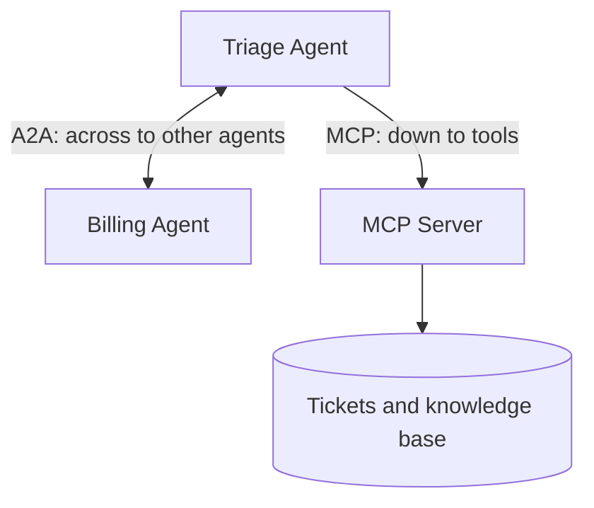

# 00 — Overview

Read this once. Five minutes. It is the mental model everything else hangs on.

New to the vocabulary? Keep the **[glossary](glossary.md)** open alongside.

---

## The one sentence

> **MCP gives an agent hands. A2A gives an agent colleagues.**

---

## Why two protocols?

An **agent** is a program that lets an AI model decide what to do next. On its
own, a model can only produce text — so every agent runs into the same two
walls.

### Wall 1 — it cannot touch anything

The model reasons well and does nothing. It needs to read the ticket, query the
database, call the API.

This is about connecting one agent **down** to capabilities.

→ **MCP** solves this.

### Wall 2 — it cannot know everything

Billing rules, network runbooks, procurement policy. Cram all of it into one
agent and you get an agent that is mediocre at everything. You want specialists
that can pass work between them.

This is about connecting agents **across** to each other.

→ **A2A** solves this.



Different layers, not competing options. Lab 3 uses both at once.

---

## Why a protocol instead of just a library?

Without a shared protocol, connecting 5 agents to 10 systems means writing
**50** separate integrations. Every new agent adds 10 more.

With a protocol, each system exposes one MCP server and each agent speaks MCP.
Now it is **15** pieces instead of 50 — and anything works with anything.

The version you meet in the field: a customer has agents built by three teams
in three frameworks and wants them to cooperate. Rewriting everything into one
framework is a year of work nobody will fund. A shared protocol makes it a much
smaller job.

---

## The example

A small IT support desk: tickets, a knowledge base, and a billing specialist.

The data is fake and lives in memory. The example is dull on purpose — nothing
here should compete with the protocols for your attention.

---

## The labs

| # | Topic | Time | What you do |
|---|---|---|---|
| 1 | [MCP](01-lab-mcp.md) | 5 min | Run a tool server; watch an agent discover its tools |
| 2 | [A2A](02-lab-a2a.md) | 5 min | Publish an agent; watch another agent delegate to it |
| ⭐ 3 | [Both together](03-lab-interop.md) | 5 min | **Optional bonus lab** — one agent that does both |

Labs 1 and 2 are the core workshop. Lab 3 is a bonus you can skip if time is
short.

Afterwards:

- [04 — Stateless MCP](04-stateless-mcp.md) — running MCP on more than one server
- [05 — Going further](05-going-further.md) — security, scale, production
- [Troubleshooting](troubleshooting.md)

---

## Before Lab 1

Do this once:

```bash
cp .env.example .env
```

Fill in the Azure values — `.env.example` explains each one. Prefer not to keep
a key in a file? Leave `AZURE_API_KEY` blank, run `uv sync --group entra`, and
sign in with `az login` instead.

Then:

```bash
uv run python scripts/preflight.py
```

This checks library versions, makes a real Azure call, and confirms the ports
are free.

Run it before presenting. It fails loudly so your demo does not.

---

## How each lab works

**Run one command. Look at one thing. Read one file.**

The reading is where the learning is. The source files carry far more comments
than normal production code, deliberately.
