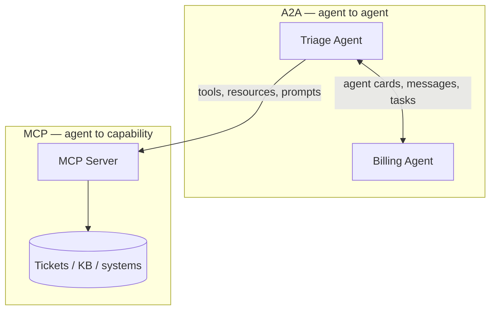

# 00 — Overview

Two protocols, fifteen minutes, one mental model.

## The one sentence to remember

> **MCP gives an agent hands. A2A gives an agent colleagues.**

Everything else is detail.

## The two problems

Every agent you build for a customer runs into the same two walls.

**Wall 1: the agent can't touch anything.** It reasons well and does nothing.
It needs to read the ticket, query the database, call the API. That is a
*vertical* problem — connecting one agent down to capabilities.

**Wall 2: one agent can't know everything.** The billing rules, the network
runbook, the procurement policy — cramming all of it into a single prompt makes
an agent that is mediocre at all of it. You want specialists that talk to each
other. That is a *horizontal* problem — connecting agents across to each other.

MCP solves the first. A2A solves the second.



They are different layers. Not competitors. Most real deployments use both,
which is exactly what Section 3 builds.

## Why these matter more than the SDK you happen to like

Both are **protocols**, not libraries. That distinction is the whole reason
they exist.

Before MCP, connecting M agents to N systems meant M×N bespoke integrations.
With a protocol it becomes M+N: each system exposes one MCP server, each agent
speaks MCP, and anything works with anything.

The version you will meet in the field: a customer has agents in three
different frameworks, written by three different teams, and wants them to
cooperate. Rewriting into one framework is a year of work nobody will fund. A
protocol makes it a Tuesday.

## The scenario

A deliberately boring internal **IT support desk**. Tickets, a knowledge base,
a billing specialist. The domain is dull on purpose — nothing here should
compete for your attention with the protocol mechanics.

## The three sections

| # | Topic | Time | You will |
|---|---|---|---|
| 1 | [MCP](01-lab-mcp.md) | ≤5 min | Run an MCP server; watch an agent discover its tools |
| 2 | [A2A](02-lab-a2a.md) | ≤5 min | Publish an agent; watch another agent delegate to it |
| 3 | [Interop](03-lab-interop.md) | ≤5 min | Build one agent that does both |

Then:

- [04 — Stateless MCP](04-stateless-mcp.md) — the deployment conversation you
  will actually have with a customer.
- [05 — Going further](05-going-further.md) — auth, gateways, production.
- [Troubleshooting](troubleshooting.md)

## Setup

One time, before Section 1:

```bash
cp .env.example .env   # then fill in your Azure OpenAI values
uv run python scripts/preflight.py
```

Prefer not to put a key in a file? Leave `AZURE_API_KEY` blank and authenticate
with Entra ID / managed identity instead — `uv sync --group entra`, then
`az login` (or assign a managed identity). Details are at the bottom of
`.env.example`.

`preflight.py` checks versions, makes a real Azure call, and confirms the ports
are free. Run it before presenting. It fails loudly so the demo doesn't.

## The shape of every section

Each lab is: run one command, look at one thing, read one file. The reading is
where the teaching is — the source files are commented far past normal
production standards on purpose. The comments are the course.
