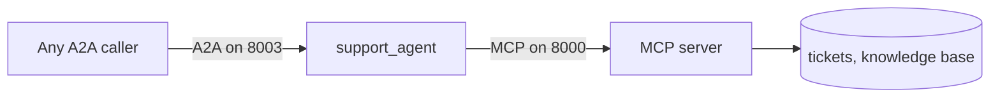

# 03 — Both together

> ### ⭐ Optional bonus hands-on lab
>
> Labs 1 and 2 are the core workshop. This one is a bonus: skip it if you are
> short on time, and come back when you want to see the two protocols working
> in the same process.

**Time: 5 minutes**

**Goal:** build one agent that **uses MCP** to get its tools and **speaks A2A**
so other agents can call it.

This is where the two halves click together.

---

## Step 1 — Start both servers (60s)

Terminal 1:

```bash
./scripts/run_mcp_server.sh
```

Terminal 2:

```bash
./scripts/run_interop.sh
```

You should see the agent start on port `8003`.

> If it fails on startup saying it cannot connect, the MCP server is not
> running. This agent has **no tools of its own** — it fetches its entire tool
> list from MCP the moment it boots.

---

## Step 2 — Look at its card (60s)

Terminal 3:

```bash
curl -s http://localhost:8003/.well-known/agent-card.json | python -m json.tool
```

You should see an agent card for `support_agent`.

So this one process is, at the same time:

- an **MCP client** — it fetched its tools from port 8000
- an **A2A server** — it publishes a card and accepts work



Read it left to right: **A2A is how work arrives. MCP is how work gets done.**

---

## Step 3 — Send it a question (90s)

```bash
curl -s -X POST http://localhost:8003/ \
  -H 'Content-Type: application/json' \
  -d '{
    "jsonrpc": "2.0",
    "id": "1",
    "method": "message/send",
    "params": {
      "message": {
        "role": "user",
        "messageId": "m1",
        "parts": [{"kind": "text", "text": "I cannot connect to the VPN. What should I try?"}]
      }
    }
  }' | python -m json.tool
```

You should see an answer drawn from the knowledge base.

What happened, in order:

1. The request arrived over **A2A**.
2. The agent decided to search the knowledge base.
3. That search went out over **MCP**, to a different process.
4. The result came back and became the answer.

Two protocols, one request — and the agent's own code contains neither an HTTP
client nor a list of tools.

---

## Step 4 — Read the source (60s)

`src/helpdesk/interop/support_agent/agent.py`:

```python
helpdesk_tools = McpToolset(
    connection_params=StreamableHTTPConnectionParams(url=MCP_URL),
    tool_filter=["lookup_ticket", "search_knowledge_base", "open_ticket"],
)

root_agent = LlmAgent(name="support_agent", ..., tools=[helpdesk_tools])
```

Notice what is missing: the agent never writes a tool signature, never builds a
schema, never makes an HTTP call. It learns all of that at startup by asking.

> **Add a new tool to the MCP server, restart, and this agent can use it — with
> no change to this file.** That is the whole point of a protocol, running in
> front of you.

And `serve.py`:

```python
app = to_a2a(root_agent, host="localhost", port=PORT)
```

One line publishes it for other agents to call.

> `to_a2a` is marked experimental in ADK. That is fine for learning, but check
> its status before a customer depends on it. Lab 2's `agent.json` approach is
> the stable one, and gives you exact control over the card.

---

## The takeaway

Ask the question this way and the confusion disappears:

> **"Is the thing on the other side a function, or a colleague?"**

A function → **MCP**. A colleague → **A2A**.

An agent with both can do work *and* be given work. That is what production
systems look like.

---

## Checkpoint

You can now answer:

- **Are MCP and A2A alternatives?** No — different layers, usually used together.
- **How does an agent get tools from an MCP server?** `McpToolset`.
- **How do you publish an agent over A2A?** `to_a2a()`, or an `agent.json` file
  plus `adk api_server --a2a`.
- **What does the agent code know about its tools?** Nothing, until runtime.

**Next:** [04 — Stateless MCP](04-stateless-mcp.md), then
[05 — Going further](05-going-further.md).
