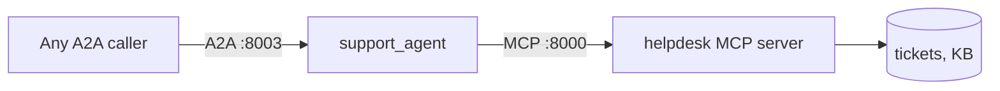

# 03 — Interop (bonus)

**Time: ≤ 5 minutes.** Optional, but it's where the two halves click together.

**Goal:** build one agent that **consumes MCP** and **is published over A2A**,
and see that they are different layers rather than competing choices.

---

## Step 1 — Start both (60s)

Terminal 1:

```bash
./scripts/run_mcp_server.sh
```

Terminal 2:

```bash
./scripts/run_interop.sh
```

**You should see** the interop agent start on `:8003`.

If it fails at startup complaining it can't connect, the MCP server isn't up.
The interop agent fetches its tool list from MCP the moment it boots — it has
no tools of its own.

---

## Step 2 — See the shape (60s)

Terminal 3:

```bash
curl -s http://localhost:8003/.well-known/agent-card.json | python -m json.tool
```

**You should see** an agent card for `support_agent`.

So this one process is simultaneously:

- an **MCP client** — it went and got its tools from `:8000`
- an **A2A server** — it publishes a card and accepts delegated work



Read that diagram left to right: A2A is how work arrives, MCP is how work gets
done. Horizontal in, vertical down.

---

## Step 3 — Drive it (90s)

```bash
curl -s -X POST http://localhost:8003/ \
  -H 'Content-Type: application/json' \
  -d '{
    "jsonrpc": "2.0",
    "id": "1",
    "method": "message/send",
    "params": {
      "message": {
        "role": "user",
        "messageId": "m1",
        "parts": [{"kind": "text", "text": "I cannot connect to the VPN. What should I try?"}]
      }
    }
  }' | python -m json.tool
```

**You should see** an answer that came from the knowledge base.

Trace what happened:

1. The request arrived over **A2A**.
2. The agent decided to search the knowledge base.
3. That search went out over **MCP** to a different process.
4. The result came back and became the answer.

Both protocols, one request, and the agent code contains neither an HTTP client
nor a tool list.

---

## Step 4 — Read the source (60s)

`src/helpdesk/interop/support_agent/agent.py` is short. The interesting part:

```python
helpdesk_tools = McpToolset(
    connection_params=StreamableHTTPConnectionParams(url=MCP_URL),
    tool_filter=["lookup_ticket", "search_knowledge_base", "open_ticket"],
)

root_agent = LlmAgent(name="support_agent", ..., tools=[helpdesk_tools])
```

Note what's absent: the agent never names a tool signature, never builds a
schema, never writes an HTTP call. It learns all of it at startup by asking.

**Add a tool to the MCP server, restart, and this agent can use it — with no
change to this file.** That is the M+N property from the overview, running.

And `serve.py`:

```python
app = to_a2a(root_agent, host="localhost", port=PORT)
```

One line publishes it as an A2A peer. (`to_a2a` is marked experimental in ADK —
fine here, check its status before a customer depends on it. Section 2's
`agent.json` route is the stable one and gives you exact control over the card.)

---

## The takeaway

Ask the question this way and it stops being confusing:

> **"Is the thing on the other side a function, or a colleague?"**

A function → MCP. A colleague → A2A. An agent that has both is an agent that
can do work *and* be given work, which is what production systems look like.

---

## Checkpoint

You can now answer:

- Are MCP and A2A alternatives? → no, they're different layers.
- How does an agent get tools from an MCP server? → `McpToolset`.
- How do you publish an ADK agent over A2A? → `to_a2a()`, or `agent.json` plus
  `adk api_server --a2a`.
- What does the agent code know about its tools? → nothing until runtime.

**Next:** [04 — Stateless MCP](04-stateless-mcp.md), then
[05 — Going further](05-going-further.md).
