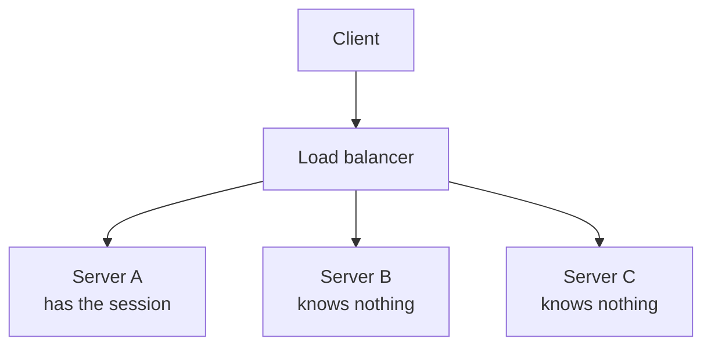
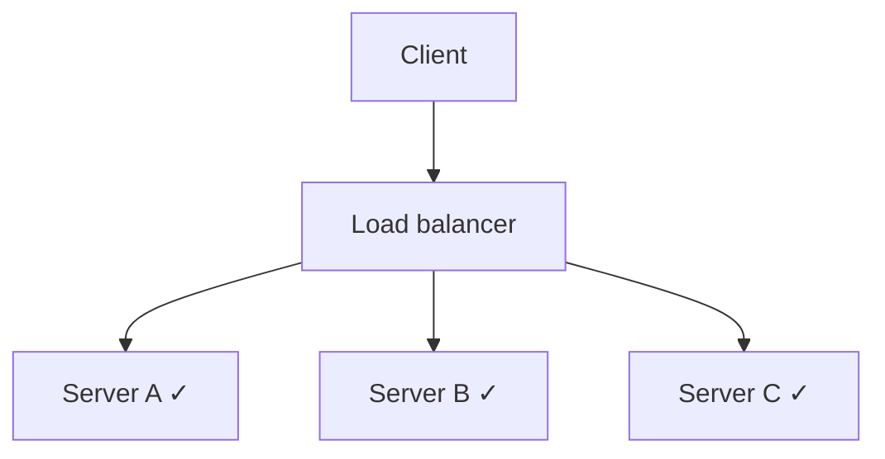

# 04 — Stateless MCP

Read this after Section 1. It is the deployment conversation you will actually
have with a customer, so it's worth more than it looks.

---

## The problem sessions create

MCP originally worked like this:

1. Client POSTs `initialize`.
2. Server replies with an `Mcp-Session-Id` header.
3. Client sends that header on every subsequent request.
4. Server keeps per-session state in memory.

Fine on a laptop. Now put it behind a load balancer:



Two out of three requests fail. The session lives in one process's memory.

### Why sticky sessions don't save you

The instinct is "turn on session affinity." It usually doesn't work here.

Many MCP clients — including several popular IDE integrations — issue requests
with a plain `fetch()` and never store or return cookies. The load balancer has
nothing to pin on. You can sometimes hash on the `Mcp-Session-Id` header
instead, but that needs L7 config the customer may not control, and it still
leaves you with stateful instances: no clean autoscale-down, no serverless,
and a redeploy drops every conversation in flight.

---

## What we run

`src/helpdesk/mcp_server/server.py`:

```python
mcp.run(transport="http", host="127.0.0.1", port=8000, stateless_http=True)
```

That's the whole change.

Each request gets a fresh, independent transport. No session is created, no
session header is returned, and nothing is remembered between requests.



Any instance can serve any request. Round-robin is enough. Autoscaling works.
Serverless works. Redeploys don't drop conversations.

You can also set it without touching code:

```bash
FASTMCP_STATELESS_HTTP=true ./scripts/run_mcp_server.sh
```

Or, if you're mounting into an existing ASGI app:

```python
app = mcp.http_app(stateless_http=True)
```

The notebook proves it: `Mcp-Session-Id returned: <none>`, and a tool call in a
completely separate request still works.

---

## What you give up

Statelessness is a trade, and you should be able to name the cost.

Anything that depends on the server remembering a client between requests is
off the table:

- **Server-initiated messages.** No pushing notifications to a specific client.
- **Resource subscriptions.** Nothing to notify.
- **Long-lived per-connection state.** Progress on a long task, cached auth
  context, an in-flight multi-step interaction.

In practice most MCP servers are request/response tool servers and lose
nothing. If you genuinely need push, keep sessions and accept the sticky-routing
architecture — or move that state to a shared store (Redis, a database) and
stay stateless at the transport.

**The rule of thumb:** default to stateless. Adopt sessions when a specific
feature forces it, and know which feature it was.

---

## Where the protocol is heading

What we're running is *transport-level* statelessness: the session machinery
still exists in the spec, we just don't use it.

MCP spec revision **`2026-07-28`** goes further and removes it from the protocol
itself. The headline changes:

- **No `initialize` handshake and no `Mcp-Session-Id`.** Each request carries
  its own protocol version and client info in `_meta`.
- **`server/discover`** — one RPC for version and capability selection up front.
- **`resultType`** on every result: `"complete"` or `"input_required"`.
- **Multi Round-Trip Requests (MRTR)** replace server-initiated calls. Instead
  of the server calling back, it returns `input_required` with a list of
  `inputRequests`, and the client retries including `inputResponses`. Same
  capability, no persistent connection required.
- **`Mcp-Method` and `Mcp-Name` HTTP headers**, so gateways can route, meter,
  and authorize per tool without parsing bodies. This is a big deal for
  enterprise deployments.
- **Cacheable list results** (`ttlMs`, `cacheScope`), deterministically ordered.
- **Deprecated:** Roots, Sampling, Logging, HTTP+SSE transport, OAuth DCR.
  `ping` and `logging/setLevel` removed.

Two things to take from that list:

1. The direction is unambiguous. Sessions were the thing standing between MCP
   and ordinary web infrastructure, and they're going.
2. **Don't build a customer workshop or a production integration on Sampling,
   Elicitation, or Roots right now.** They're deprecated or era-gated.

### Why this workshop pins stable FastMCP 3.4.7

The 2026-07-28 protocol needs `mcp>=2.0`, which today means a beta FastMCP 4.
Google ADK pins `mcp<2`. Putting both in one environment forces two virtualenvs
and a beta dependency into a teaching repo.

The stateless *lesson* — the part a customer will ask you about — is fully
teachable on stable FastMCP 3.4.7 with `stateless_http=True`, in one
environment, with everything pinned and reproducible. So that's what we run.

Simple and straightforward before flashy. When ADK moves to `mcp` 2.x, this
repo moves with it and the lesson doesn't change.

---

## The 30-second version for a customer

> "MCP used to require sticky sessions, which made it awkward to deploy behind
> a load balancer. Stateless mode removes that — any instance can serve any
> request, so it scales like any other HTTP service. The protocol is moving
> that way permanently. If you need server-push, you'll keep sessions, but
> most tool servers don't."

That's the whole conversation.
